  

  

 

<h3 align="center">👨‍💻 About Me</h3>

> 🔭 I’m currently working on **expanding my skills in software development and systems design.** 
> 🌱 I’m currently learning **advanced Rust concepts and performance optimization.** 
> 👯 I’m looking to collaborate on **Open Source projects, especially in C, C++, Python, or Rust.** 
> 💬 Ask me about **C, C++, Python, and Rust.** 
> ⚡ Fun fact: **I love writing clean, memory-efficient code!**

 

<h3 align="center">🛠️ Languages & Tools</h3>

  
  
  
  
    
  
  
  

 

<h3 align="center">📊 GitHub Stats</h3>

  
  

  

 

<h3 align="center">📈 Commits & Activity</h3>

  

 

  
  <b style="color: #39d353; font-size: 18px;">Commits being consumed & mined!</b>
  

  

  

